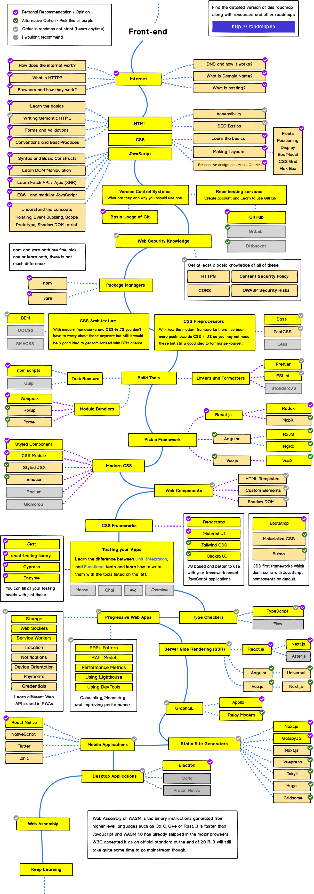

یکی از سوالاتی که از من در جاهای مختلف توسط دوستان شده است که چه لازم است تا برنامه‌نویسی را شروع کنیم و یا چه لازم است که Senior FrontEnd Engineer باشیم.

#

#

# چگونه برنامه‌نویسی را شروع کنیم؟

برای شروع لازم است که با اینترنت آشنا باشید و سپس بدانید HTML, CSS و JavaScript چه هستند و چه نقشی در صفحه‌ی یک وب‌سایت دارند، همان‌طور که در ویدئو توضیح دادم ساختار وب‌سایت توسط این سه تکنولوژی برنامه‌نویسی می‌شود.

# چگونه برنامه‌نویس Junior یا Mid-Level در FrontEnd شویم؟
مجموعه‌ تکنولوژی‌هایی که می‌بایست بلد باشید و تسلط شما نشان‌دهنده‌ی آن‌است. خب مشخصا CSS Style های معروف مثل FLEXBOX یا CSS GRID و یا فریم‌ورک‌های معروف جاوااسکریپت مثل React میتوانند به شما کمک کنند تا دانش لازم برای ارتقاء خود به برنامه‌نویس Mid-Level تبدیل شوید.

خب مشخصا تکنولوژی هایی مثل Git نیز لازم هستند تا بتوانید در یک شرکت خوب کار کنید و دوره‌ی مقدماتی React JS می‌تواند شروع خوبی برای این روند باشد.

# چطور به سمت Senior FrontEnd Developer شدن برویم؟
خب مسیری که می‌بایست چند سال طی ‌شود تسلط به تکنولوژی‌ها و سپس رفع ایرادات آن‌هاست. اما برای کسب دانش می‌توانید دوره React Advanced من را شروع کنید.

اما Senior شدن تنها به کسب دانش ختم نمی‌شود. رزومه‌ی شما، تعداد پروژه‌هایی که توسعه‌ داده‌اید و تیم‌هایی که در آن‌ها کار کرده‌اید نقش اساسی‌ای دارند.

سپس برای آن‌که برنامه‌نویس بهتری باشید می‌بایست به مباحثی مثل Clean Coding و Software Architecture نیز مسلط شوید که امیدوارم در ویدئو‌های بعدی بیشتر بتوانم آن‌ها را توضیح دهیم.

  

اگر اینجا‌ هستید، خوشحال می‌شوم نظرتان را بدانم و مطمئنا به دوستان خواننده نیز کمکی خواهید کرد.