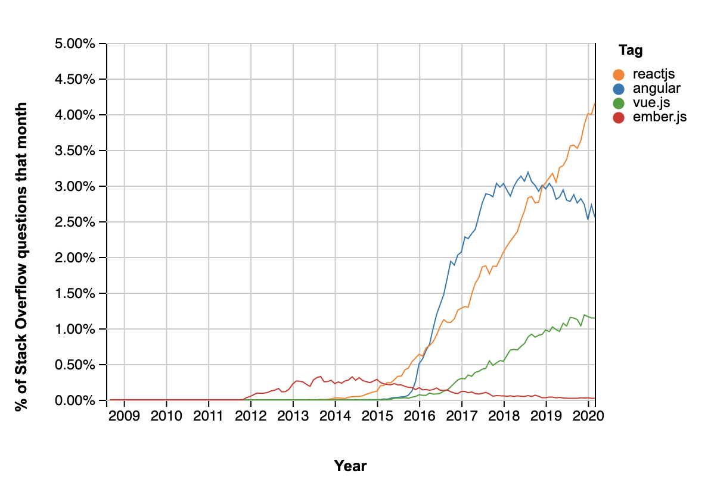

# طول دوره: بیش از ۵ ساعت

# تعدا ویدئو‌ها: بیش از ۴۰ ویدئو

چندین سالی هست که React JS به لیست Library های JavaScript اضافه شده و می‌دونین که خب توسط Facebook هم مدیریت میشه و ورژن های جدیدش ارائه میشه.

خب مزایایی که React ارائه داد و سادگی استفاده اش باعث شد از وقتی با بازار اومد همه راجبش صحبت کنن و الان تقریبا درصد زیادی از محصولات با این تکنولوژی در FrontEnd نوشته میشن.

یادگیری React خب مسلما به شما بازار کار بهتر و مطمئن تری رو ارائه میده و خب به دلیل گسترگی استفاده می‌تونین محصولات خیلی پیچیده رو هم به راحتی باهاش برنامه نویسی کنید.

این دوره که در اصل تمام دانش مقدماتی هست که تیم FrontEnd در React در سطح Mid Level ازش استفاده میکنه میتونه بهتون کمک کنه که طی چند ساعت با نحوه‌ی ساختن یک ‌وب‌سایت آشنا بشید و بتونین رزومه خودتون یا محصولی که در ذهن دارین رو برنامه نویسی کنید.

پروژه
برای این که بعد از دیدن ویدئو ها مطمئن بشیم که به خوبی محتواها رو به خاطر سپردید و میتونین استفاده کنین لازم هست پروژه‌ی عملی ای انجام بدین. پیشنهاد من تعریف یک پروژه شخصی هست که در طول دوره اون رو develop کنید.

مشخصا سوالات زیادی براتون مطرح خواهد شد که در گروه تلگرامی دوره میتونین مطرح کنین و اگر سوالات کمی متداوم بشن مسلما من ویدئوی تکمیلی به دوره اضافه خواهم کرد و جواب سوالات رو خواهم داد.

شما می‌تونید این پروژه رو به راحتی جزوی از رزومتون قرار بدین و برای کارهای Junior تا Mid-Level در برنامه نویسی FrontEnd درخواست بدین.

# در این دوره چه یاد خواهید گرفت؟
این دوره با هدف آشنایی با React و بررسی تمام کارهایی که با این Library میتوان کرد شکل گرفته است. شروع خوبی برای پیاده‌سازی اپ‌های ساده است
، شما یاد خواهید گرفت:

* چگونه با React کار کنید و یک اپ ساده را شروع کنید
* شما مفاهیم Virtual DOM و تفاوت آن با حالت معمولی را خواهید آموخت
* شما می‌توانید از Hooks ها که Function های جدید در React هستند استفاده کنید
* شما می‌توانید یک اپ فروشگاهی بنویسید و با LocalStorage کار کنید و سبد خرید طراحی کنید
* شما می‌توانید صفحات مختلف در وب‌سایت خود بسازید و آن را در جاهای مختلف Deploy کنید
* شما میتوانید انیمیشن و عکس و آیکن در پروژه استفاده کنید و ساختار خوبی به پروژه خود بدهید
* شما با کتابخانه Create React App کار خواهید کرد و به آن مسلط می‌شوید

# پروژه
برای این که بعد از دیدن ویدئو ها مطمئن بشیم که به خوبی محتواها رو به خاطر سپردید و میتونین استفاده کنین لازم هست پروژه‌ی عملی ای انجام بدین. پیشنهاد من تعریف یک پروژه شخصی هست که در طول دوره اون رو develop کنید.

مشخصا سوالات زیادی براتون مطرح خواهد شد که در گروه تلگرامی دوره میتونین مطرح کنین و اگر سوالات کمی متداوم بشن مسلما من ویدئوی تکمیلی به دوره اضافه خواهم کرد و جواب سوالات رو خواهم داد.

شما می‌تونید این پروژه رو به راحتی جزوی از رزومتون قرار بدین و برای کارهای Junior تا Mid-Level در برنامه نویسی FrontEnd درخواست بدین.

پروژه‌هایی که در طول دوره انجام شده‌اند:
* [تکلیف دوره یا پروژه Todo](https://todo-app-5hwjlgaxy.vercel.app/ "تکلیف دوره یا پروژه Todo")
* [پروژه فروشگاهی ساده همراه با سبد خرید](https://react-for-beginners.now.sh "پروژه فروشگاهی ساده همراه با سبد خرید")

# سوالات متداول:
* چه پیش‌ نیازی برای شرکت در دوره لازم است؟

برای شرکت در این دوره شما می‌بایست تنها آشنایی با HTML, CSS داشته باشید و بدانید JavaScript چه کاری در صفحه می‌کند
در واقع در دنیای امروز بسیاری از برنامه نویسان فرانت اند می‌توانند با این دوره شروع کنند و وب‌سایت و اپ‌های کوچک ساده‌ای بسازند

* آیا این دوره برای برنامه نویسان Backend خوب هست؟

اگر برنامه‌نویس زبان های Object Oriented هستید حتما این دوره براتون جالب خواهد بود و می‌بینید که چطور Functional Programming نقش بزرگی رو در React بازی میکنه. پیشنهاد میکنم حتما اگر می‌خواهید سمت Full Stack Developer شدن بیاین با این دوره شروع کنید.
* آیا میتوانم با اکانت Paypal پرداخت کنم؟

اگر خارج ایران هستید، میتوانید از Paypal برای پرداخت استفاده کنید، فقط کافی است مبلغ ۵۹ دلار آمریکا (TAX اضافه شده است) برای من واریز کنید و سپس مسیجی در تلگرام یا اینستاگرام من بفرستید تا اکانتتان در سایت active شود.(لینک)

 
 

# محتوای دوره
-  ابزار‌ها و محیط برنامه‌نویسی با React
- [آشنایی با مفاهیم React و تفاوت آن با سایر کتابخانه‌ها](/react-basic-concepts)
- JSX چیست و چطور از Babel استفاده کنیم
- کامپوننت چیست و چطور اولین کامپوننت (React Component) را بنویسیم
- چطور از Create React App استفاده کنیم
- روش استفاده از CSS و استایل دادن به کامپوننت‌ها
- کد زدن برای داشتن Layout یا ساختار صفحه با React
- props ها در React چه هستند و چطور از آن‌ها استفاده کنیم
- چطور با React Router صفحات مختلف بسازیم
- چطور با Event ها در React کار کنیم
- مدیریت State ها و چطور آن‌ها را در یک کامپوننت تغییر دهیم و استفاده کنیم
- چطور یک کامپوننت به روش قدیمی و به صورت Class بنویسیم
- مفهوم Life Cycle در React چیست؟‌ و چطور در روش قدیمی از آن استفاده می‌کردیم
- چطور data ای را در کامپوننت داشته باشیم و آن را در State قرار دهیم
- آشنایی با useEffect در React
- چطور data را از API بخوانیم و در React نمایش دهیم
- آشنایی با useCallback در React
- با Context آشنا شویم و از useContext استفاده کنیم
- چطور با useRef کار کنیم
- آشنایی با Hook ها از کتاب‌خانه React Router و useLocation
- اضافه کردن Icon به پرورژه و آشنایی با مفهوم Fragment
- آشنایی با useReducer یکی از Hook های React و نحوه‌ی پیاده‌سازی آن
- چطور از ترکیب useReducer و useContext استفاده کنیم
- آشنایی با نحوه‌ی اضافه کردن Animation به پروژه
- چطور Route مشخصی برای صفحه هر محصول داشته باشیم
- مفهوم validate کردن prop ها و Type Checking با کتاب‌خانه‌ی prop-types
- نحوه‌ی ساده‌ای برای Store Persistence در React و بارگذاری مجدد State در کامپونتت‌ها
- آشنایی با utils ها و ساختار دادن App
- آشنایی با React DevTools به عنوان Browser Extension
- آماده‌سازی پروژه Create React App برای محیط Production
- چطور با Now JS پروژه‌ی خود را در Deploy کنیم

## ویدئو‌های سوالات متداول
- راه‌های نمایش عکس در پروژه
- چگونه از eslint برای استانداردسازی codebase همراه با vscode استفاده کنیم
- چگونه با git کار کنیم و پروژه Create React App رو در Github Pages قرار بدهیم یا Deploy کنیم
- چگونه در پروژه Create React App از SASS استفاده کنیم
- چطور در پروژه Create React App از Bootstrap استفاده کنیم
- چگونه در پروژه Create React App از Material UI استفاده کنیم
- تعریف زبان‌های Backend مانند NodeJs، PHP و غیره و نحوه‌ی قدیم و جدید ارتباط آن‌ها با Frontend، کاربر React و بررسی Wordpress
- چگونه در پروژه‌های React می‌توانیم Slideshow داشته باشیم
- آشنایی با White Pages و کد زدن Loading و Placeholder برای بخش های مختلف سایت

## تکلیف دوره
- پیاده ‌سازی یک اپلیکیشن Todo با React

## جلسات آنلاین / رفع اشکال و بررسی کد‌ها
- کلاس آنلاین بررسی و Refactoring برای یک نمونه کد Timer
- کلاس آنلاین برای بررسی کد سنگ کاغذ قیچی
- کلاس آنلاین درس برای بررسی پروژه Todo

## برنامه‌نویسی تکلیف دوره و پروژه Todo ( آپلود شده در تاریخ ۲۰ مرداد ۱۳۹۹)

- شروع پروژه، نصب پیش‌نیاز ها و ساختن ساختار پروژه
- برنامه‌نویسی استایل‌های اولیه و ساختار کامپوننت‌ها
- استایل دادن بیشتر و آماده‌سازی پروژه و آشنایی با BEM
- اضافه کردن فانکشن‌های AddTask, DeleteTask
- اضافه کردن Filtering و تغییر وضعیت تسک‌ها
- پیاده سازی localStorage و Persistence برای پروژه و Deploy کردن آن

# خرید دوره

 به مناسبت بازگشایی دوره در سایت فارسی خودم، تا تاریخ ۵ شهریور هزینه‌ی دوره برابر با ۵۰۰ هزار تومان خواهد بود که یعنی بیش از ۴۰ درصد تخفیف

لطفا برای خرید دوره مبلغ
<strike>870,000</strike>
522,000
 تومان را از طریف لینک پرداخت زیر واریز نمایید و سپس پیغامی به تلگرام من بدهید.

- [تلگرام من](https://t.me/ehsangazar)
- [لینک پرداخت](https://me.pay.ir/ehsangazar)
