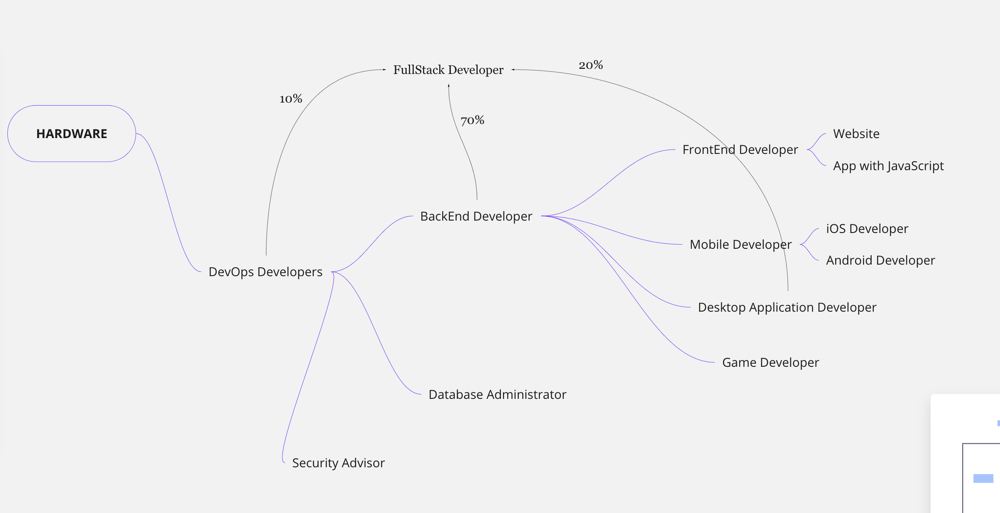

یکی از مسائلی که برای تصمیم گیری شما از آینده‌ی کاریتان در دنیای برنامه‌نویسی کمک خواهد کرد دانستن این است که چه ارتباطی بین شغل‌ها و ایجاد یک نرم‌افزار یا وب‌سایت یا حتی یک بازی وجود دارد

 

 

چارت بالا در ویدئو توضیح داده شده است و شما می توانید رابطه‌ی خوبی بین برنامه‌نویسان برقرار کنید و دانش بهتری داشته باشید.
